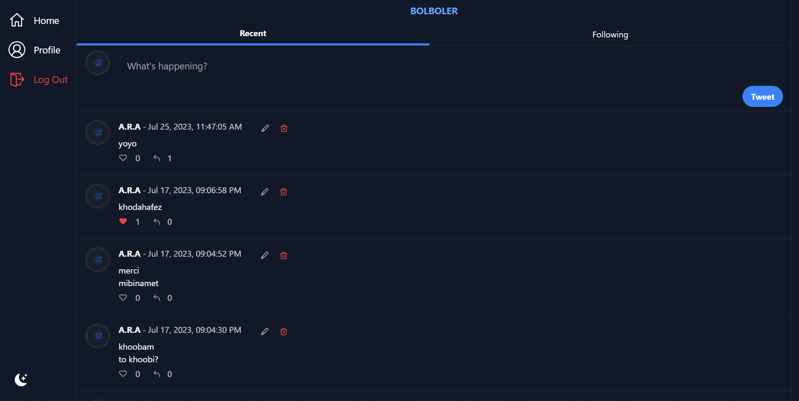
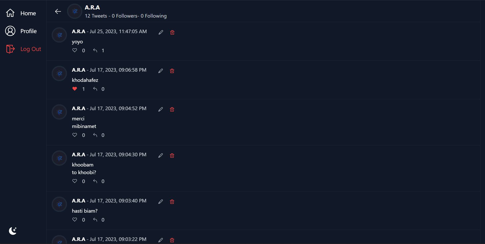
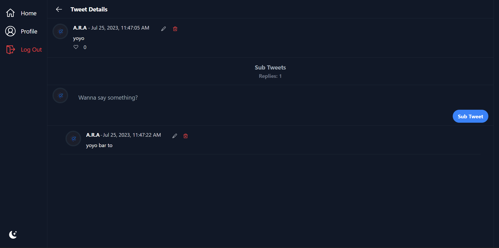
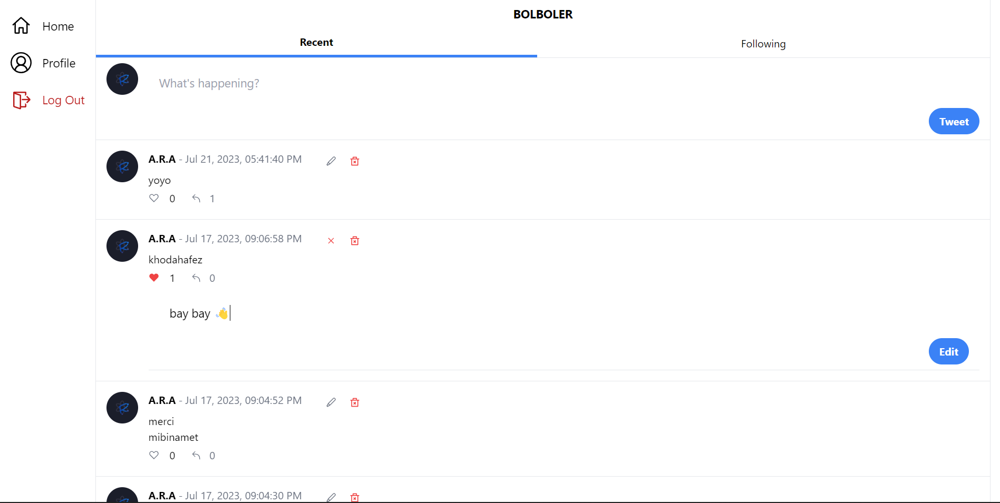
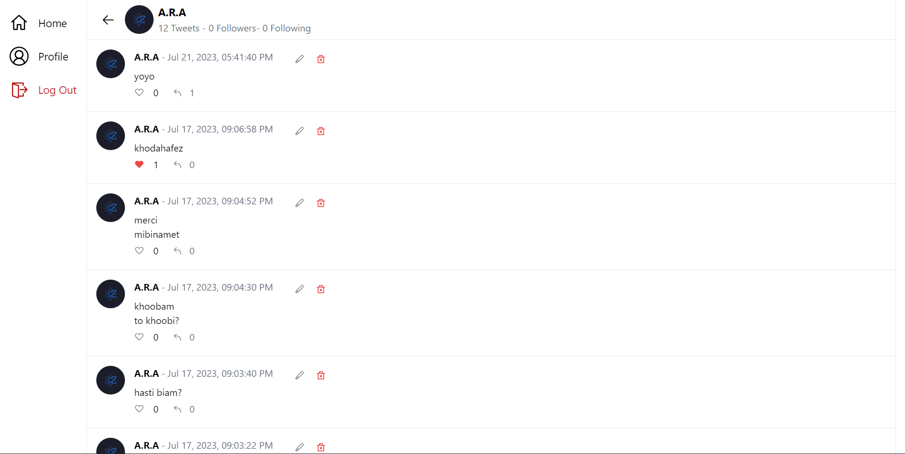
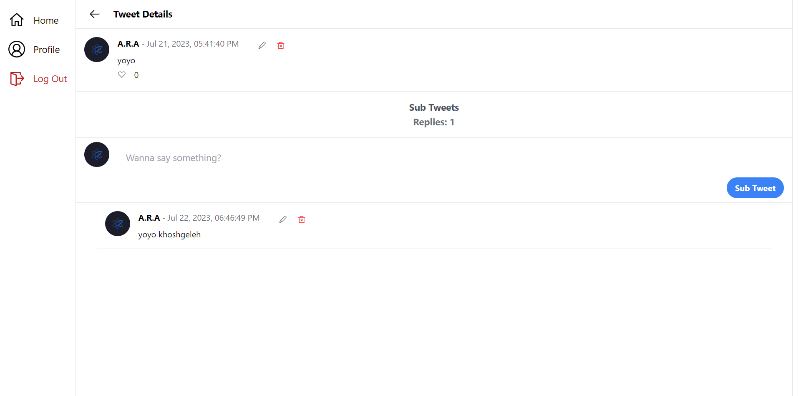

# Bolboler

## It's just a twitter like web application.

### You can see the deployed project just by [clicking here](https://Bolboler.vercel.app)

 
 

# Language and technologies used in This Project

 
 
 

# Dark Mode

### Home

### Profile

### Tweet

# Light Mode

### Home

### Profile

### Tweet

 

# **Abilities**

-   Fully Responsive
-   Able To:
    -   Authentication & Authorization:
        -   Able To SignIn, Log and Logout with discord
    -   Tweets:
        -   Able To add Tweet
        -   Able To edit Tweet
        -   Able To delete Tweet
        -   Able To Infinite Scroll On Tweets
    -   Follow:
        -   Able To Follow other users
        -   Able To Be Followed By Other Users
        -   Able To See Followers
        -   Able To See Followings
