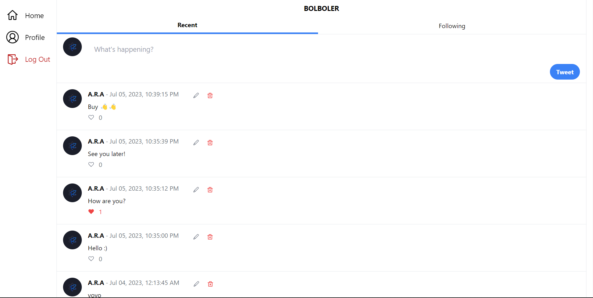

<h1 align='center' style="font-size:5rem"><b>Bolboler</b></h1>

   
<h2 align='center'>
    It's just a twitter like web application.
</h2>

  

    <h3>You can see the deployed project just by <a href="https://Bolboler.vercel.app">clicking here</a></h3>

   

<h1 align='center'><b>Language and technologies used in This Project</h1>
</img>
</img>
</img>
</img>
</img>
</img>

 
</img>
</img>
</img>
</img>
</img>

   

    <h1><b>Images</b></h1>
    <h2>SignIn</h2>
    </img>
     

    

<h1 align='center'><b>Abilities</b></h1>

<ul>
    <li> Able To SignIn, Log and Logout with discord</li>
    <li> Able To add Tweet</li>
    <li> Able To edit Tweet</li>
    <li> Able To delete Tweet</li>
    <li> Able To Infinite Scroll</li>
</ul>
